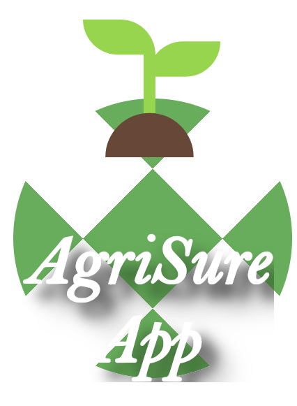

# AgriApp

## Overview

AgriApp is a comprehensive application designed to assist farmers and agricultural stakeholders in managing their lands, monitoring weather conditions, and performing remote sensing analysis for soil health. The app aims to leverage modern technologies to provide valuable insights and streamline various agricultural processes.

<table style="border-collapse: collapse; max-width: 80%; margin: auto; background-color: #fff; border-radius: 8px; box-shadow: 0 2px 10px rgba(0, 0, 0, 0.1);">
        <tr>
            <td style="text-align: center; padding: 16px; vertical-align: middle;">
                
            </td>
        </tr>
        <tr>
            <td style="text-align: center; padding: 16px; vertical-align: middle;">
                Using software systems by (thanks to)
            </td>
        </tr>
        <tr>
            <td style="text-align: center; padding: 16px; vertical-align: middle;">
                
                
                
                
            </td>
        </tr>
        <tr>
            <td style="text-align: center; padding: 16px; vertical-align: middle;">
                In consultation for problem statements with professors from
            </td>
        </tr>
        <tr>
            <td style="text-align: center; padding: 16px; vertical-align: middle;">
                
            </td>
        </tr>
    </table>

## Table of Contents

- [Features](#features)
- [Tech Stack](#tech-stack)
- [Setup and Installation](#setup-and-installation)
- [Usage](#usage)
- [API Endpoints](#api-endpoints)
- [Contributing](#contributing)
- [License](#license)

## Features

- **User Authentication**: Signup and login functionality for users.
- **Dashboard**: Personalized user dashboard with various options.
- **Live Weather**: Real-time weather information for specific lands.
- **Land Management**: Add and manage land details.
- **Remote Sensing Analysis**: Perform soil health analysis using remote sensing data.

## Tech Stack

### Frontend

- React Native
- React Navigation

### Backend

- Node.js
- Express.js
- MongoDB
- Mongoose

## Setup and Installation

### Prerequisites

- Node.js
- MongoDB
- React Native CLI

### Backend Setup

1. **Clone the repository**:

    ```sh
    git clone <your-github-repo-url>
    cd your-project/backend
    ```

2. **Install dependencies**:

    ```sh
    npm install
    ```

3. **Configure MongoDB**:

    Ensure MongoDB is running on your machine. You can start MongoDB using:

    ```sh
    mongod
    ```

4. **Run the backend server**:

    ```sh
    npm start
    ```

### Frontend Setup

1. **Navigate to the frontend directory**:

    ```sh
    cd ../frontend
    ```

2. **Install dependencies**:

    ```sh
    npm install
    ```

3. **Run the React Native app**:

    ```sh
    npx react-native run-android # For Android
    npx react-native run-ios # For iOS
    ```

## Usage

1. **Create an Account**:
    - Open the app and navigate to the "Create Account" screen.
    - Fill in the required details and sign up.

2. **Dashboard**:
    - After signing up, you'll be redirected to your personalized dashboard.
    - Explore various features like Live Weather, Add Land, and Remote Sensing Analysis.

3. **Live Weather**:
    - View real-time weather information for your lands.

4. **Add Land**:
    - Add details of your land including survey number, state, and land name.

5. **Remote Sensing Analysis**:
    - Perform soil health analysis using remote sensing data.

## API Endpoints

### Authentication

- **Signup**: `POST /api/auth/signup`
- **Login**: `POST /api/auth/login`

### Land Management

- **Add Land**: `POST /api/land/add`
- **Get Lands**: `GET /api/land`

### Weather

- **Get Weather**: `GET /api/weather/:landId`

## Contributing

We welcome contributions to improve AgriApp. To contribute:

1. Fork the repository.
2. Create a new branch (`git checkout -b feature/your-feature`).
3. Make your changes and commit them (`git commit -m 'Add some feature'`).
4. Push to the branch (`git push origin feature/your-feature`).
5. Create a new Pull Request.

## License

This project is licensed under the MIT License - see the [LICENSE](LICENSE) file for details.
